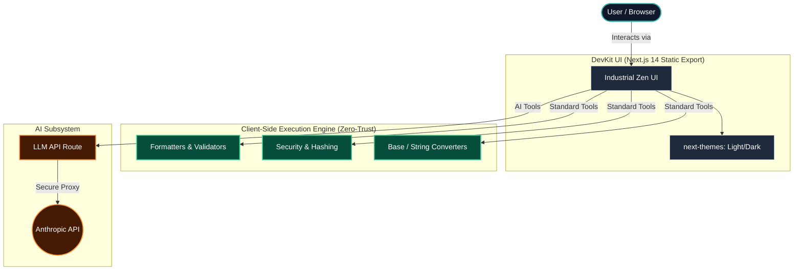
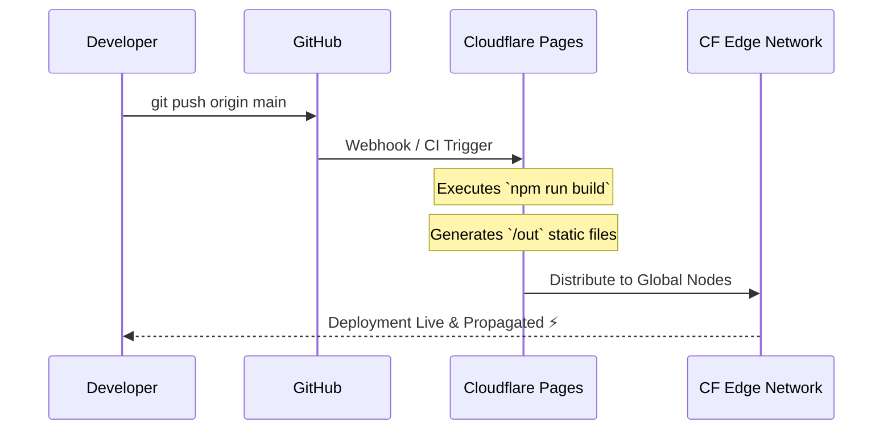

<div align="center">

# ⚡ DevKit

**A fast, free, and uncompromisingly private suite of developer utilities.**

*All processing happens securely in your browser. Zero tracking. Zero server-side logging.*

[Explore the Tools](https://www.google.com/search?q=%23-tool-catalog) • [Architecture](https://www.google.com/search?q=%23-system-architecture) • [Deployment](https://www.google.com/search?q=%23-deployment-pipeline) • [Contributing](https://www.google.com/search?q=%23-contributing)

</div>
---

## 🌌 Overview

**DevKit** is an enterprise-grade collection of essential utilities designed for developers, system architects, and engineers. Built with a focus on performance and privacy, everything runs locally on your machine with zero server round-trips—ensuring your sensitive data, tokens, and code snippets never leave your browser.

Wrapped in an **Industrial Zen** and **Cinematic Dark Mode** aesthetic—featuring deep charcoal palettes, seamless glassmorphism, and subtle emerald green and ice blue accents—DevKit provides a distraction-free, visually stunning workspace.

The only exception to our strict client-side rule is our **Agentic AI suite**, which securely interfaces with the Anthropic API to provide intelligent code generation, regex building, and text fixing.

---

## 🏗 System Architecture

DevKit utilizes a modern static-export Next.js architecture, ensuring maximum edge-delivery speed while offloading computation directly to the client.



---

## 🛠 Tool Catalog

### 💻 Developer Utilities

*The core essentials for data structuring and formatting.*

* ✅ **JSON Formatter & Validator:** Lint, format, and strictly validate JSON payloads.
* ✅ **JWT Decoder:** Safely decode JSON Web Tokens without exposing secrets.
* ✅ **UUID Generator:** Instantly generate v4 UUIDs.
* 🚧 **Cron Expression Parser:** *(In Development)* Human-readable cron schedule translator.
* 🚧 **Color Converter:** *(In Development)* HEX/RGB/HSL/CMYK interoperability.
* 🚧 **Text Diff Checker:** *(In Development)* Line-by-line code difference analysis.

### 📝 Text Manipulation

*Advanced string operations and typographic tools.*

* ✅ **Case Converter:** Transform text instantly (camelCase, snake_case, PascalCase, kebab-case).
* ✅ **Word & Character Counter:** Real-time metrics and reading time estimation.
* ✅ **Lorem Ipsum Generator:** Configurable placeholder text generation.
* 🚧 **Markdown Preview:** *(In Development)* GitHub-flavored markdown rendering.
* 🚧 **String Escape/Unescape:** *(In Development)* Safe formatting for JSON, HTML, and SQL strings.

### 🔐 Security & Cryptography

*Robust local hashing and credential generation.*

* ✅ **Password Generator:** Entropy-based generation with a visual strength meter.
* ✅ **Hash Generator:** Compute SHA-1, SHA-256, SHA-384, and SHA-512 hashes instantly.
* ✅ **Base64 Encoder / Decoder:** Reliable binary-to-text encoding.
* 🚧 **Bcrypt Hash & Verify:** *(In Development)* Secure password salting and hashing.

### 🔄 Data Converters

*Seamless transformation between standards.*

* ✅ **Unix Timestamp Converter:** Epoch-to-human-readable and timezone translations.
* ✅ **Number Base Converter:** Binary, Octal, Decimal, and Hexadecimal manipulation.
* ✅ **URL Encode / Decode:** Safe URI component parsing.
* 🚧 **JSON ↔ YAML:** *(In Development)* Cross-format object conversion.
* 🚧 **CSV ↔ JSON:** *(In Development)* Tabular to object array translation.
* 🚧 **HTML Entity Encode:** *(In Development)* Secure character escaping.

### 🌐 Network & Media

*Diagnostic and visual generation tools.*

* ✅ **HTTP Status Codes:** Comprehensive reference library for REST APIs.
* ✅ **QR Code Generator:** Instant matrix barcode creation for URLs and text.
* 🚧 **IP Lookup:** *(In Development)* Geolocation and ISP routing data.
* 🚧 **URL Parser:** *(In Development)* Scheme, host, path, and query parameter breakdown.
* 🚧 **SVG Viewer:** *(In Development)* Scalable vector graphic preview and code extraction.

### 🧠 Agentic AI Suite (Powered by Anthropic)

*Next-generation tools utilizing LLMs for cognitive offloading.*

* 🤖 **AI Text Improver:** Context-aware grammar and tone optimization.
* 🤖 **AI Regex Builder:** Natural language to complex Regular Expression compilation.
* 🤖 **AI JSON Fixer:** Automated repair of malformed or truncated JSON payloads.

---

## ⚙️ Tech Stack & Specifications

| Layer | Technology | Description |
| --- | --- | --- |
| **Framework** | Next.js 14 | Utilizing the App Router and configured for `output: 'export'` |
| **Styling** | Tailwind CSS | Utility-first CSS with custom CSS Variables for themes |
| **Typography** | Inter & JetBrains Mono | Optimized for readability and dense code blocks |
| **Theming** | next-themes | Seamless Light/Dark cinematic mode toggling without hydration mismatch |
| **Infrastructure** | Cloudflare Pages | Edge network deployment on the free tier for global low-latency |

---

## 🚀 Local Development

Getting DevKit running locally is frictionless. Ensure you have Node.js 18+ installed.

```bash
# 1. Clone the repository
git clone https://github.com/yourusername/devkit.git
cd devkit

# 2. Install dependencies
npm install

# 3. Start the development server
npm run dev

```

> **Note:** Access the local environment at `http://localhost:3000`. Hot-module replacement is enabled by default.

---

## 🌍 Deployment Pipeline

DevKit is highly optimized for **Cloudflare Pages**.



### Deployment Steps:

1. Push your local repository to GitHub.
2. Navigate to your [Cloudflare Dashboard](https://www.google.com/search?q=https://dash.cloudflare.com/) → **Workers & Pages**.
3. Click **Create application** → **Pages** → **Connect to Git**.
4. Select the DevKit repository.
5. Configure the build settings:
* **Framework preset:** Next.js (Static HTML Export)
* **Build command:** `npm run build`
* **Output directory:** `out`


6. Click **Save and Deploy**.

### 🧩 Subdirectory Mounting (Optional Proxy)

If deploying under a specific path (e.g., `[yourdomain.com/tools](https://yourdomain.com/tools)`), implement the included edge proxy.
*See `cloudflare-worker.js` in the root directory for the exact Worker routing script.*

---

## 🔌 Extending DevKit (Adding a New Tool)

DevKit's architecture makes adding new utilities highly modular.

1. **Register the Tool:** Open `src/lib/tools.ts` and add your tool's metadata (Name, ID, Icon, Category).
2. **Build the Component:** Create your logic and UI in `src/components/tools/YourNewTool.tsx`. Stick to the Tailwind CSS variable palettes to ensure it inherits the Light/Dark mode styling correctly.
3. **Mount the Route:** Import and render your newly created component inside the dynamic routing handler at `src/app/tools/[id]/page.tsx`.

---

## 🤝 Contributing

Enterprise-level software requires community scrutiny and collaboration. Pull Requests are highly encouraged.

1. Fork the Project
2. Create your Feature Branch (`git checkout -b feature/AmazingTool`)
3. Commit your Changes (`git commit -m 'Add some AmazingTool'`)
4. Push to the Branch (`git push origin feature/AmazingTool`)
5. Open a Pull Request

*Have an idea for a new tool? Please open an **Issue** first to discuss architectural integration before submitting a PR.*